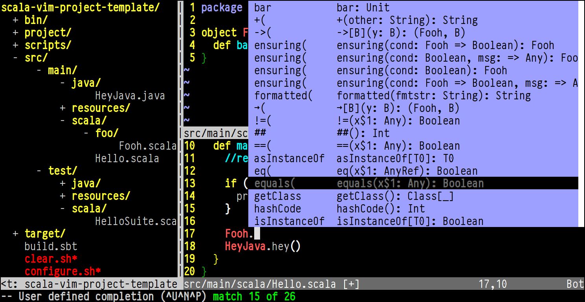

scala-vim-project-template
======================

Scala/Java project template for dedicated Vim users.

Dependencies
------------
- vim
- [eclim](http://eclim.org/install.html)
- scala
- sbt

How to use
------------
1. Rename current directory to some good project name
1. Put the same project name into **build.sbt**
1. ./configure.sh
1. Enjoy. Type something and try **C-x C-u** for autocomplete

License
-------
Copyright (C) 2015 Alexander Lopatin

This work is free. You can redistribute it and/or modify it under the
terms of the Do What The Fuck You Want To Public License, Version 2,
as published by Sam Hocevar. The details are below:
>                DO WHAT THE FUCK YOU WANT TO PUBLIC LICENSE
>                        Version 2, December 2004
>    
>     Copyright (C) 2004 Sam Hocevar <sam@hocevar.net>
>    
>     Everyone is permitted to copy and distribute verbatim or modified
>     copies of this license document, and changing it is allowed as long
>     as the name is changed.
>    
>                DO WHAT THE FUCK YOU WANT TO PUBLIC LICENSE
>       TERMS AND CONDITIONS FOR COPYING, DISTRIBUTION AND MODIFICATION
>    
>      0. You just DO WHAT THE FUCK YOU WANT TO.
